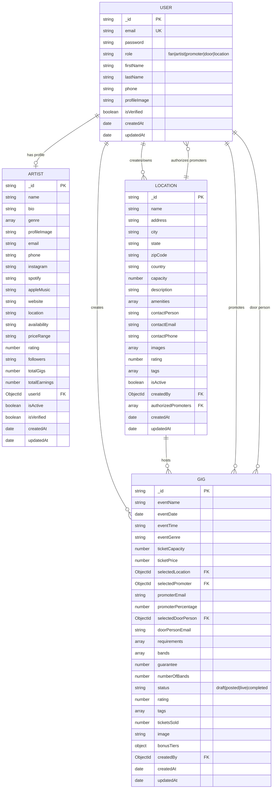
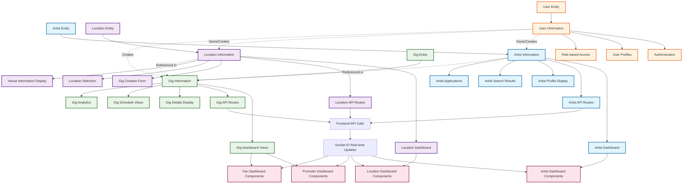

# VENU Entity Relationship Diagram & Data Flow Chart

## Entity Relationship Diagram (ERD)

This diagram shows the relationships between all entities in the VENU system, demonstrating how artist information comes from the Artist entity and gig information comes from Location and Dashboard entities.

## Data Flow Chart

This diagram shows how data flows through the VENU system, specifically demonstrating that ALL artist information comes from the Artist entity and ALL gig information comes from Location and Dashboard entities.

## Key Relationships and Data Flow

### Artist Information Flow
- **Source**: Artist Entity (`backend/src/models/Artist.ts`)
- **API Routes**: `/api/artists/*` (`backend/src/routes/artists.routes.ts`)
- **Frontend Integration**: `src/lib/api.ts` - `artistApi` functions
- **Dashboard Display**: `src/components/artist-dashboard.tsx`
- **Data Includes**: Name, bio, genre, contact info, social media, location, availability, pricing, ratings, metrics

### Location Information Flow
- **Source**: Location Entity (`backend/src/models/Location.ts`)
- **API Routes**: `/api/locations/*` (`backend/src/routes/locations.routes.ts`)
- **Frontend Integration**: `src/lib/api.ts` - location-related functions
- **Dashboard Display**: `src/components/location-dashboard/`
- **Data Includes**: Venue details, capacity, amenities, contact info, authorized promoters

### Gig Information Flow
- **Source**: Gig Entity (`backend/src/models/Gig.ts`)
- **API Routes**: `/api/gigs/*` (`backend/src/routes/gigs.routes.ts`)
- **Frontend Integration**: `src/lib/api.ts` - `gigApi` functions
- **Dashboard Display**: Multiple dashboards (promoter, location, fan, artist)
- **Data Includes**: Event details, bands, requirements, pricing, status, analytics

### User Information Flow
- **Source**: User Entity (`backend/src/models/User.ts`)
- **API Routes**: `/api/auth/*` and user-related routes
- **Frontend Integration**: Authentication and role-based access
- **Dashboard Display**: User profiles and role-specific dashboards
- **Data Includes**: Authentication, roles, personal information

## Data Flow Summary

1. **Artist Information**: Flows exclusively from the Artist entity through API routes to artist dashboards and displays
2. **Gig Information**: Flows from the Gig entity (which references Location and User entities) to all dashboard types
3. **Location Information**: Flows from the Location entity to location dashboards and gig creation forms
4. **User Information**: Flows from the User entity to provide authentication and role-based access control

The system ensures data integrity by maintaining clear entity relationships and using proper foreign key references between entities.
